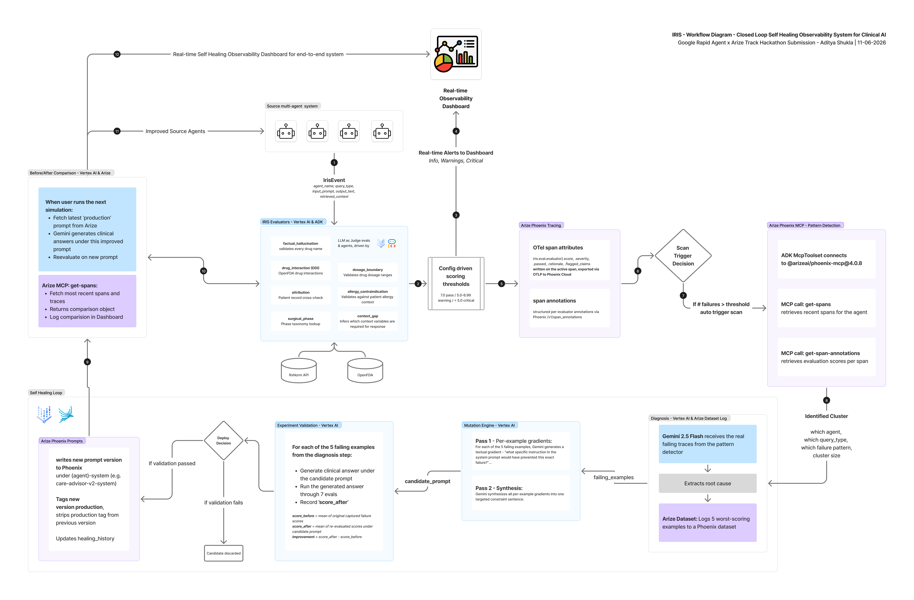

# IRIS - Inference Risk and Integrity Supervisor

[](LICENSE)

A self-healing observability layer for clinical AI. IRIS evaluates every output from clinical agents in real time across 7 safety evaluators, traces everything to Arize Phoenix, detects recurring failure patterns using its own observability data, and autonomously rewrites the failing system prompt - validating the fix before it goes live.

Built for the [Google Cloud Rapid Agent Hackathon](https://rapid-agent.devpost.com/) - Arize Phoenix Track.

Demo Video: [Iris Demo](https://youtu.be/vlp-cjAwNNU)

---



---


---

## How it works

```
Clinical AI Agent
      | POST /event (IrisEvent)
      v
+---------------------------------------------------------------------+
|                         IRIS Supervisor                             |
|                                                                     |
|  7 Safety Evaluators (concurrent, Gemini 2.5 Flash + RxNorm/FDA)   |
|    factual_hallucination, dosage_boundary, drug_interaction,        |
|    allergy_contraindication, attribution, context_gap,              |
|    surgical_phase                                                   |
|           |                                                         |
|    OTel spans + REST annotations --> Arize Phoenix Cloud            |
|           |                                                         |
|  Alert Dispatch (SSE) --> Dashboard live feed                       |
|           |                                                         |
|  [on critical cluster] Event-driven scan trigger                    |
|           |                                                         |
|  Pattern Detector (ADK LlmAgent + Phoenix MCP get-spans)            |
|           |                                                         |
|  Diagnosis (Gemini - root cause from real failing traces)           |
|           |                                                         |
|  Mutation Engine (TextGrad-style: per-example gradients + synth)    |
|           |                                                         |
|  Experiment Validation (candidate prompt vs real failures, seed=42) |
|           |                                                         |
|  Deploy to Phoenix (versioned, tagged production/candidate)         |
+---------------------------------------------------------------------+
      |
      v
Clinical AI Agent runs under improved prompt
```

---

## What makes it different

Most observability tools tell you something went wrong after the fact. IRIS:

1. **Catches failures in real time** - 7 evaluators run concurrently on every agent output, grounded in RxNorm and OpenFDA.
2. **Closes the loop automatically** - when a failure cluster crosses the threshold, IRIS reads its own Phoenix spans via MCP, diagnoses the root cause, mutates the system prompt, and validates the fix against real captured failures before deploying it.
3. **Makes the improvement measurable** - run baseline scenarios (synthetic responses at first, for demo purposes), trigger a heal, then re-run in Live Generation mode (agent generates under the new prompt pushed to Phoenix in real time). The Before/After comparison panel shows pass rate delta and prompt hash change side by side.

---

## Quickstart

**Prerequisites:** Python 3.11+, a Google Cloud project with Vertex AI enabled, an Arize Phoenix Cloud account.

```bash
# 1. Clone
git clone https://github.com/adityashukla8/iris.git
cd iris

# 2. Install
pip install -e ".[dev]"

# 3. Configure credentials
cp .env.example .env
# Edit .env: GOOGLE_CLOUD_PROJECT, PHOENIX_API_KEY, PHOENIX_CLIENT_URL

# 4. Start
uvicorn core.main:app --port 8081 --reload

# 5. Open the dashboard
open http://localhost:8081/

# 6. Run demo scenarios
python demo/mock_agents/simulator.py --url http://localhost:8081
```

---

## The self-improvement loop (demo flow)

1. Open the dashboard at `/dashboard`
2. Click **Run Scenarios** - select **Synthetic Response** mode - run all 9 or selective scenarios. These are pre-scripted unsafe outputs; most will score critical.
3. Wait for the activity log to show "event-driven scan triggered" - or click **Run Scan** manually.
4. Watch the self-healing pipeline: pattern detection, diagnosis, mutation, experiment validation, prompt deployed to Phoenix.
5. Click **Run Scenarios** again - switch to **Live Generation** mode. IRIS now generates each answer in real time under the healed prompt (registered in and fetched via Arize Phoenix).
6. The **Agent Improvement** panel on the Overview tab shows pass rate before and after, critical delta, and the prompt hash that changed.

---

## Evaluators

| Evaluator | What it catches | Knowledge source |
|---|---|---|
| `factual_hallucination` | Drug names not in RxNorm; impossible values; invented procedures | RxNorm API + Gemini LLM judge |
| `dosage_boundary` | Doses outside FDA-approved range; missing renal adjustment | OpenFDA API + Gemini LLM judge |
| `drug_interaction` | Dangerous drug-drug combinations in the recommended regimen | OpenFDA + Gemini LLM judge |
| `allergy_contraindication` | Drug recommended from a class the patient is allergic to | Allergy context + Gemini LLM judge |
| `attribution` | Claims not traceable to the patient record; cross-patient contamination | Gemini LLM judge |
| `context_gap` | Clinical question answered without required patient variables | Gemini (dynamic inference) |
| `surgical_phase` | Recommendations inappropriate for the current surgical phase | Phase taxonomy + Gemini LLM judge |

All evaluators run at `temperature=0.0, seed=42` for deterministic, reproducible scoring. Threshold: >= 7.0 pass / 5.0-6.99 warning / < 5.0 critical.

---

## ADK agents and MCP

IRIS uses two ADK `LlmAgent` instances that introspect its own observability data through the Arize Phoenix MCP server (`@arizeai/phoenix-mcp@4.0.8`):

**pattern_detector** - reads recent spans and annotations to identify failure clusters. Uses `get-spans` and `get-span-annotations`. Falls back to deterministic clustering if the MCP call fails.

**mcp_probe** - a general-purpose read agent exposed at `POST /mcp/chat`. Gives you a conversational interface to your Phoenix data: spans, prompts, datasets, experiments, evaluations. 10 read-only MCP tools.

A `before_tool_callback` clamps MCP `limit` args and an `after_tool_callback` strips 40+ bloat attributes from responses (50-80% size reduction) before the LLM context sees them.

---

## API reference

| Method | Path | Description |
|---|---|---|
| `POST` | `/event` | Submit an IrisEvent for evaluation |
| `GET` | `/stream/alerts` | SSE stream of live safety alerts |
| `GET` | `/stream/activity` | SSE stream of pipeline activity |
| `GET` | `/status` | Shift stats - traces, alerts, heals |
| `GET` | `/traces` | Recent trace feed (last 200) |
| `GET` | `/traces/{trace_id}` | Single trace detail |
| `POST` | `/scan` | Trigger immediate self-healing scan |
| `GET` | `/simulate/comparison` | Before/after simulation run comparison |
| `POST` | `/simulate` | Run demo scenarios (`mode: recorded` or `live`) |
| `POST` | `/mcp/chat` | Conversational Phoenix MCP probe |
| `GET` | `/healing/candidates` | Pending heal candidates awaiting approval |
| `POST` | `/healing/approve/{id}` | Approve a candidate prompt |
| `POST` | `/healing/reject/{id}` | Reject a candidate prompt |
| `GET` | `/healing/history` | History of completed heals |
| `GET` | `/analytics` | Evaluator heatmap and severity breakdown |
| `GET` | `/prompts/{agent}/production` | Current production prompt for an agent |

---

## Connecting a clinical agent

Any agent submits its outputs to IRIS via `POST /event`:

```python
from sdk.client import IrisClient
from sdk.models import IrisEvent, QueryType

async with IrisClient("http://localhost:8081") as iris:
    result = await iris.submit(IrisEvent(
        agent_name="care-advisor-v2",
        query_type=QueryType.DRUG_DOSAGE,
        input_prompt=user_query,
        output_text=agent_response,
        retrieved_context={
            "patient_id": "PT-001",
            "creatinine_clearance": 34.1,
            "current_medications": ["lisinopril 10mg"],
            "allergies": ["penicillin"]
        },
    ))
```

Or via curl without the SDK:

```bash
curl -X POST http://localhost:8081/event \
  -H "Content-Type: application/json" \
  -d '{
    "agent_name": "care-advisor-v2",
    "query_type": "drug_dosage",
    "input_prompt": "What dose of gentamicin for this patient?",
    "output_text": "Gentamicin 240mg IV every 8 hours...",
    "retrieved_context": {"patient_id": "PT-001", "creatinine_clearance": 18.0}
  }'
```

---

## Project structure

```
iris/
├── core/
│   ├── agents/
│   │   ├── pattern_detector.py   # ADK LlmAgent; Phoenix MCP get-spans
│   │   └── mcp_probe.py          # ADK LlmAgent; 10 read-only MCP tools
│   ├── evaluators/
│   │   ├── base.py               # EvalPlugin ABC
│   │   ├── factual_hallucination.py
│   │   ├── dosage_boundary.py
│   │   ├── drug_interaction.py
│   │   ├── allergy_contraindication.py
│   │   ├── attribution.py
│   │   ├── context_gap.py
│   │   ├── surgical_phase.py
│   │   └── service.py            # Concurrent evaluation orchestration
│   ├── healing/
│   │   ├── scan.py               # Scan entry point; lock + debounce + cooldown
│   │   ├── diagnose.py           # Root cause from real failing traces
│   │   ├── mutation_engine.py    # TextGrad-style prompt mutation
│   │   ├── experiment.py         # Counterfactual validation gate
│   │   ├── pipeline.py           # Deploy to Phoenix; human-in-the-loop option
│   │   ├── prompt_manager.py     # Phoenix prompt CRUD
│   │   └── prompt_identity.py    # Content-hash versioning
│   ├── knowledge/
│   │   ├── rxnorm.py             # RxNorm API + LLM drug extraction
│   │   └── fda_labels.py         # OpenFDA label client (cached)
│   ├── phoenix/
│   │   ├── client.py             # REST span annotations
│   │   └── tracing.py            # OTel provider registration
│   ├── mcp_filter.py             # Before/after tool callbacks; strips bloat attrs
│   ├── alerts.py                 # Alert dispatch + event-driven scan trigger
│   ├── config.py                 # Pydantic Settings
│   ├── state.py                  # In-memory alert bus; recent traces deque
│   └── main.py                   # FastAPI app; all route handlers
├── sdk/
│   ├── models.py                 # IrisEvent, EvalResult, AlertEvent (Pydantic v2)
│   └── client.py                 # IrisClient - async HTTP client
├── dashboard/
│   └── templates/
│       ├── index.html            # Homepage
│       └── dashboard.html        # Live operations dashboard
├── demo/
│   ├── mock_agents/
│   │   ├── simulator.py          # 9 clinical failure scenarios (recorded mode)
│   │   └── live_agent.py         # Live Gemini generation under current prompt
│   └── patients/                 # Synthetic patient records
├── tests/
├── Dockerfile
├── cloudbuild.yaml
└── pyproject.toml
```

---

## Environment variables

```env
GOOGLE_CLOUD_PROJECT=your-gcp-project-id
GOOGLE_CLOUD_LOCATION=us-central1

PHOENIX_API_KEY=...              # Arize Phoenix system key
PHOENIX_CLIENT_URL=https://app.phoenix.arize.com/s/your-space

IRIS_PORT=8081
IRIS_ENV=development

# Self-healing thresholds
HEALING_AUTO_APPROVE=true        # false = queue for human review
HEALING_IMPROVEMENT_THRESHOLD=1.5
PATTERN_MIN_SAMPLES=3
PATTERN_WINDOW_MINUTES=60
```

Models are also configurable via env:

```env
GEMINI_MODEL=gemini-2.5-flash          # live agent + healing pipeline
EVAL_GEMINI_MODEL=gemini-2.5-flash     # evaluator judges
MCP_GEMINI_MODEL=gemini-2.5-pro        # pattern detector (needs Pro for MCP tool schemas)
```

---

## Deploying to Cloud Run

Cloud Build handles the full deploy pipeline. The `cloudbuild.yaml` at the repo root builds the Docker image, pushes to Artifact Registry, and deploys to Cloud Run with `--min-instances=1` (keeps state warm for SSE and the npx MCP server) and `--max-instances=1` (in-memory state requires a single instance).

```bash
gcloud builds submit --config cloudbuild.yaml \
  --substitutions=_REGION=us-central1 .
```

Required secrets in Secret Manager: `PHOENIX_API_KEY`, `PHOENIX_CLIENT_URL`.

The Cloud Run service account needs `roles/aiplatform.user` for Vertex AI Gemini access.

---

## Built with

- [Google ADK 2.x](https://google.github.io/adk-docs/) - agent runtime; `LlmAgent`, `Runner`, `McpToolset`
- [Gemini 2.5 Flash + Pro](https://deepmind.google/technologies/gemini/) via Vertex AI - evaluator judges and MCP agents
- [Arize Phoenix](https://phoenix.arize.com/) - OTel spans, prompt versioning, datasets, experiments, MCP server
- [RxNorm API](https://lhncbc.nlm.nih.gov/RxNav/) (NLM) - drug name validation
- [OpenFDA API](https://open.fda.gov/) - drug label and dosage grounding
- FastAPI + Server-Sent Events - API layer and real-time dashboard

---

## License

Apache 2.0 - see [LICENSE](LICENSE). Copyright 2026 Aditya Shukla.
